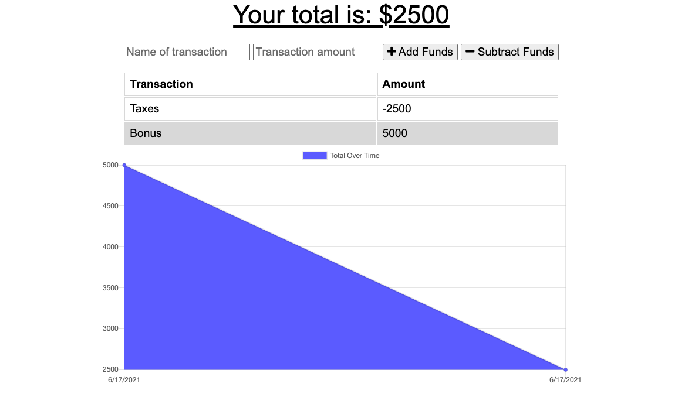

# Budget-Tracker

Javascript application that allows for the tracking of transactions in a budget, both adding and subtracting funds.
This application uses IndexedDB to allow for asynchronous storage of transactions entered even when disconnected from the internet.

## Technologies Used

- HTML
- Javascript
- IndexedDB
- Heroku
- Github

## Usage

The application can be launched from:
https://cryptic-shore-69196.herokuapp.com/

## Screenshot

## Developer

Fernando de Orbegoso

## License

